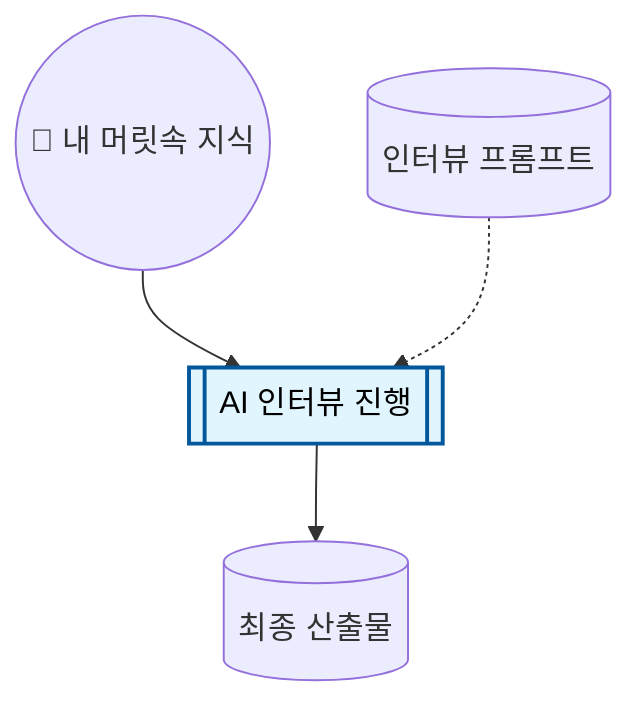
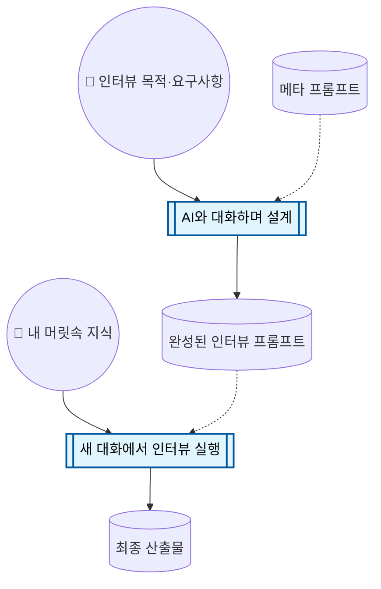

# 프롬프트 키트

유신 AI 활용 교육 전 세션에서 사용한 메타 프롬프트 모음입니다. ChatGPT, Gemini 등 대화형 AI에 붙여넣어 사용하세요.

## 프롬프트 목록

| # | 파일 | 세션 | 용도 |
|---|------|------|------|
| 1 | [homework-interviewer.md](./homework-interviewer.md) | S1 과제 | AI가 인터뷰어가 되어 업무 맥락 문서를 작성 |
| 2 | [prompt-refine-coach.md](./prompt-refine-coach.md) | S3 | 작성한 프롬프트의 품질을 개선하는 코치 |
| 3 | [big-picture-interviewer.md](./big-picture-interviewer.md) | S4 | 복잡한 문제를 실행 가능한 하위 문제로 분해 |
| 4 | [micro-tool-interviewer.md](./micro-tool-interviewer.md) | S4 | HTML 마이크로 도구 기획 사양서 작성 |
| ⭐ | [interview-prompt-builder.md](./interview-prompt-builder.md) | — | 나만의 인터뷰 프롬프트를 만드는 메타 프롬프트 |

## ⭐ 나만의 인터뷰 프롬프트 만들기

인터뷰 프롬프트는 내 머릿속 지식을 구조화된 문서로 바꿔줍니다:

적합한 인터뷰 프롬프트가 없다면? **메타 프롬프트**가 그 프롬프트를 만들어줍니다:

[interview-prompt-builder.md](./interview-prompt-builder.md)가 이 메타 프롬프트입니다. AI에 붙여넣고 대화를 시작하세요.

## 사용법

1. 원하는 프롬프트 파일을 엽니다
2. 내용 전체를 복사합니다
3. ChatGPT, Gemini 등에서 **새 대화**를 시작합니다
4. 복사한 내용을 붙여넣고 전송합니다
5. AI의 안내에 따라 대화를 진행합니다

## 팁

- 각 프롬프트는 **새 대화**에서 시작하세요. 기존 대화에 붙여넣으면 맥락이 섞입니다.
- AI의 질문에 구체적으로 답할수록 결과물의 품질이 올라갑니다.
- 최종 산출물(문서, 사양서 등)은 복사하여 별도 파일로 저장하세요.
