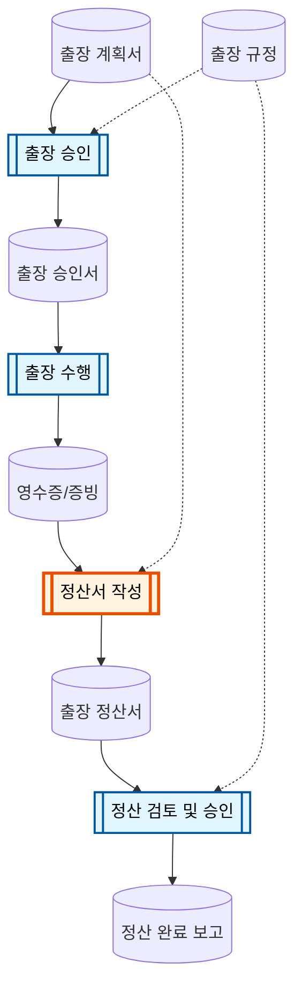
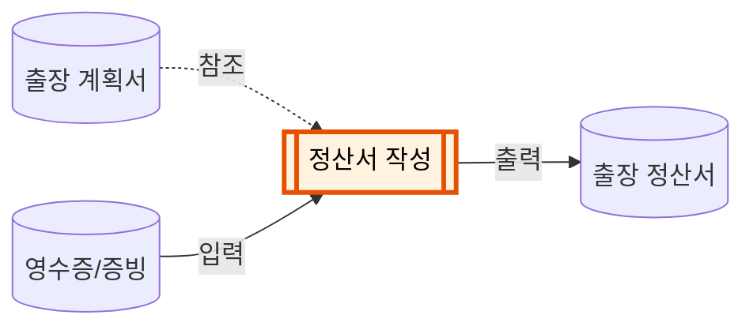

# 과제 2: 입력-출력 산출물 준비

## 과제 안내

세션 2에서 만든 업무 흐름도를 바탕으로, **프로세스 노드 1개**를 선택하고 해당 프로세스의 **입력 산출물**과 **출력 산출물**을 준비합니다.

## 진행 방법

1. 세션 2에서 완성한 업무 흐름도를 확인합니다.
2. 흐름도의 프로세스 노드 중 **AI로 개선해 보고 싶은 것 1개**를 선택합니다.
3. 선택한 프로세스의 **입력 산출물** (프로세스에 들어가는 문서/데이터)을 준비합니다.
4. 같은 프로세스의 **출력 산출물** (프로세스를 거쳐 만들어지는 문서/데이터)을 준비합니다.
5. 필요 시 **개인정보 및 민감 정보를 익명화**합니다.

---

## 예시: 출장 정산 업무

아래는 출장 정산 업무 흐름도에서 **「정산서 작성」** 프로세스를 선택한 경우입니다.

### 1단계 — 흐름도에서 프로세스 선택

주황색으로 강조된 **「정산서 작성」** 이 이번에 선택한 프로세스입니다.
이 프로세스로 **들어오는 화살표**(입력)와 **나가는 화살표**(출력)를 따라가면 준비할 산출물을 알 수 있습니다.

### 2단계 — 입력과 출력 식별

선택한 프로세스 노드만 떼어 보면 구조가 명확합니다:

| 구분 | 산출물 | 설명 | 파일 예시 |
|:---:|---|---|---|
| **입력** | 영수증/증빙 | 프로세스의 **주요 입력** — 출장 중 수집한 영수증, 교통비 내역 등 | `영수증_내역.csv` |
| **참조** | 출장 계획서 | 정산 시 **참고하는** 자료 — 출장 일정, 목적, 예산 등 | `출장계획서_202502.md` |
| **출력** | 출장 정산서 | 프로세스를 거쳐 **만들어지는** 자료 — 작성 완료된 정산서 | `출장정산서_202502.md` |

### 3단계 — 실제 파일 준비

위 표의 두 산출물에 해당하는 **실제 업무 파일**을 각각 1개씩 준비합니다.

---

## 출력 산출물, 왜 필요한가요?

> **"AI한테 시켜볼 건데, 왜 정답까지 내가 미리 만들어야 하죠?"**

출력 산출물은 **AI 결과를 판단할 기준선(baseline)** 입니다.

**비교 없이는 평가할 수 없습니다.**
AI가 만든 정산서가 "잘 된 건지" 판단하려면, 내가 직접 만든 정산서와 나란히 놓고 봐야 합니다. 기준 없이 AI 결과만 보면 그럴듯해 보이는 오류를 놓치게 됩니다.

**"원하는 결과"를 구체적으로 정의하는 연습입니다.**
"정산서 만들어 줘"라는 막연한 요청과, 완성된 정산서를 보여주며 "이 형태로 만들어 줘"라는 요청은 AI 결과의 품질 차이가 큽니다. 출력 산출물을 미리 준비하는 과정 자체가 **원하는 결과를 정밀하게 정의하는 훈련**입니다.

> 핵심: **"내가 원하는 출력이 정확히 무엇인지" 정의하는 것**이 좋은 프롬프트의 출발점입니다.
> 세션 3에서 이 원리를 직접 체험합니다.

---

## 준비 요건

### 파일 형식: 텍스트 기반으로 변환

AI에게 파일을 전달할 때 가장 안정적인 형식은 **텍스트 파일**입니다. 원본이 어떤 형식이든, 아래 표를 참고하여 텍스트 기반 형식으로 변환해 주세요.

| 원본 형식 | 변환 방법 | 결과 형식 |
|---|---|---|
| **HWP, Word, PDF** | 내용을 복사하여 텍스트 또는 마크다운 파일에 붙여넣기 | `.txt` 또는 `.md` |
| **Excel, 스프레드시트** | CSV로 내보내기 (파일 > 다른 이름으로 저장 > CSV) | `.csv` |
| **이미지 (영수증 스캔 등)** | 텍스트로 직접 옮겨 적기, 또는 표 형태로 정리 | `.txt` 또는 `.csv` |

> 서식(글꼴, 색상, 셀 병합 등)은 AI가 읽지 못합니다. **내용(텍스트와 숫자)** 이 온전히 전달되는 것이 중요합니다.

### 그 외 요건

- 실제 업무에서 사용하는 파일을 가져오세요
- **입력과 출력이 한 쌍**이어야 합니다 — 같은 프로세스의 "전"과 "후"
- 민감한 내용은 이름, 금액, 날짜 등을 임의 값으로 교체하세요

## 세션 3에서의 활용

준비한 산출물은 세션 3에서 다음과 같이 사용됩니다:

1. **입력 산출물**을 AI에게 주고 **출력 산출물**을 만들어 보도록 요청
2. AI가 만든 결과를 **본인이 직접 만든 출력과 비교·평가**
3. 차이를 분석하며 **파일 기반 프롬프팅** 실습
